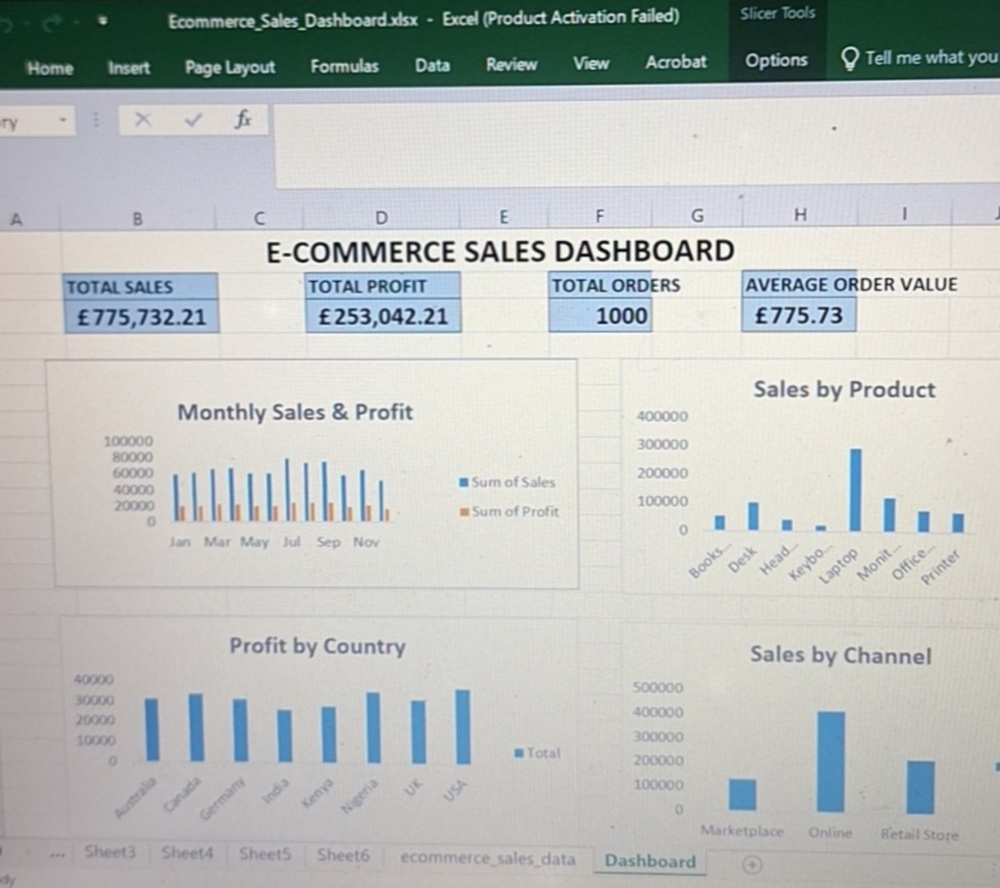

# E-Commerce Sales Dashboard

An interactive e-commerce sales analytics project built with **Microsoft Excel and Power BI** to analyze sales, profit, products, countries, categories, and sales channels.

## 📊 Project Overview

This project transforms a 1,000-transaction fictional e-commerce dataset into interactive business dashboards using Microsoft Excel and Power BI.

The dashboards allow users to monitor key performance indicators, explore sales trends, compare products and countries, and filter results interactively.

## 🎯 Business Questions

The project was designed to answer questions such as:

- What are the total sales and total profit?
- What is the average order value?
- How are sales and profit changing over time?
- Which products generate the most sales?
- Which countries generate the most profit?
- Which sales channels generate the most revenue?
- How does performance change across product categories?
- How do different countries and sales channels affect overall performance?

## 📈 Dashboard Features

### KPI Metrics

- Total Sales
- Total Profit
- Total Orders
- Average Order Value

### Visualizations

- Monthly Sales & Profit
- Sales by Product
- Profit by Country
- Sales by Sales Channel

### Interactive Filters

The dashboards include filters for:

- Country
- Sales Channel
- Category

Selecting a filter automatically updates the relevant metrics and visualizations.

## 🧰 Tools Used

### Microsoft Excel

- Excel Tables
- PivotTables
- PivotCharts
- Slicers
- Excel formulas
- KPI calculations
- Data aggregation
- Business dashboard design

### Power BI

- Power BI Desktop
- Data import and transformation
- Data type management
- KPI cards
- Interactive charts
- Slicers
- Dashboard layout and formatting

## 🗂️ Dataset

The dataset contains **1,000 fictional e-commerce transactions** created specifically for portfolio and analytical practice.

The dataset includes:

- Order ID
- Order Date
- Customer
- Country
- Region
- Product
- Category
- Quantity
- Unit Price
- Discount
- Sales
- Cost
- Profit
- Payment Method
- Sales Channel

## 🧮 Key Metrics

| Metric | Value |
|---|---:|
| Total Sales | £775,732.21 |
| Total Profit | £253,042.21 |
| Total Orders | 1,000 |
| Average Order Value | £775.73 |

## 💡 Business Value

The dashboard provides a simple way for a business stakeholder to monitor sales performance and identify differences across products, countries, categories, and sales channels.

Interactive filters make it possible to investigate specific segments without manually filtering the underlying dataset.

## 📸 Dashboard Preview



## 📁 Project Structure

```text
excel-sales-dashboard/
│
├── Ecommerce_Sales_Dashboard.xlsx
├── Ecommerce_Sales_Dashboard.pbix
├── ecommerce_sales_data.csv
├── generate_data.py
├── dashboard-preview.png
├── .gitignore
└── README.md
⚠️ Data Disclaimer

The dataset is fictional and was generated specifically for this portfolio project. It does not represent real company transactions or confidential business information.

🚀 Future Improvements

Potential improvements include:

Adding monthly growth KPIs
Adding profit margin analysis
Adding customer segmentation
Adding discount-performance analysis
Adding more advanced Power BI measures
Adding additional business-focused insights
👤 Author

Mr Wayne

Aspiring Data Analyst focused on Excel, SQL, Python, and Power BI.
